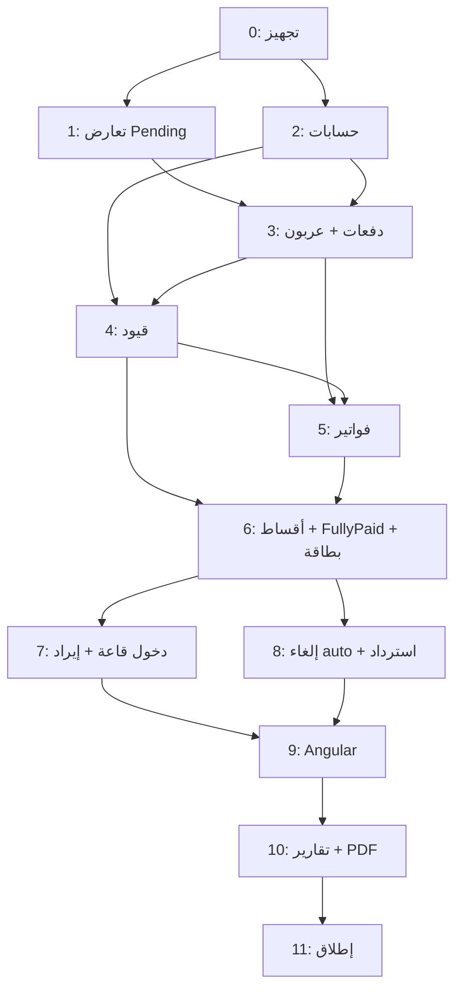

# خطة التنفيذ — النظام المالي وتطوير دورة الحجز

## وثيقة التنفيذ العملي — الإصدار 1.0

| البند | التفاصيل |
|-------|----------|
| **المرجع** | [financial-system-design.md](./financial-system-design.md) v2.0 |
| **المشروع** | BanquetHallManagement (ABP 10 + Angular 21) |
| **المدة التقديرية** | 8–12 أسبوع (مطور واحد) · 4–6 أسابيع (مطوران) |
| **منهجية** | Vertical Slices + DDD + اختبار بعد كل مرحلة |

---

## فهرس المراحل

| # | المرحلة | المدة | الاعتماد |
|---|---------|-------|----------|
| 0 | [التجهيز والأساس](#المرحلة-0-التجهيز-والأساس) | 2–3 أيام | — |
| 1 | [تعديل منطق الحجز والتعارض](#المرحلة-1-تعديل-منطق-الحجز-والتعارض) | 3–4 أيام | 0 |
| 2 | [شجرة الحسابات والبنية التحتية المالية](#المرحلة-2-شجرة-الحسابات-والبنية-التحتية-المالية) | 3–4 أيام | 0 |
| 3 | [وحدة الدفعات + تأكيد العربون](#المرحلة-3-وحدة-الدفعات--تأكيد-العربون) | 5–7 أيام | 1, 2 |
| 4 | [القيود المحاسبية](#المرحلة-4-القيود-المحاسبية) | 4–5 أيام | 2, 3 |
| 5 | [الفواتير + Console Handler](#المرحلة-5-الفواتير--console-handler) | 3–4 أيام | 3, 4 |
| 6 | [الأقساط + FullyPaid + بطاقة الدخول](#المرحلة-6-الأقساط--fullypaid--بطاقة-الدخول) | 5–6 أيام | 3, 4, 5 |
| 7 | [تأكيد دخول القاعة + ترحيل الإيراد](#المرحلة-7-تأكيد-دخول-القاعة--ترحيل-الإيراد) | 3–4 أيام | 6 |
| 8 | [الإلغاء التلقائي + الاسترداد](#المرحلة-8-الإلغاء-التلقائي--الاسترداد) | 4–5 أيام | 6, 7 |
| 9 | [واجهات Angular](#المرحلة-9-واجهات-angular) | 7–10 أيام | 3–8 |
| 10 | [التقارير + PDF + Email](#المرحلة-10-التقارير--pdf--email) | 4–6 أيام | 9 |
| 11 | [الاختبار الشامل والإطلاق](#المرحلة-11-الاختبار-الشامل-والإطلاق) | 3–5 أيام | الكل |

---

## مخطط التبعيات



---

## المرحلة 0: التجهيز والأساس

**الهدف:** تجهيز البيئة والهيكل دون كسر النظام الحالي.

### المهام

| # | المهمة | الملفات / الموقع |
|---|--------|------------------|
| 0.1 | إنشاء فرع Git `feature/finance-module` | — |
| 0.2 | إنشاء مجلدات Domain/Application للمالية | `Domain/Finance/` · `Application/Finance/` |
| 0.3 | توثيق قرارات التصميم (ADR) مختصر | `docs/adr/` |
| 0.4 | إضافة Enums مشتركة | `Domain.Shared/Enums/` |
| 0.5 | توسيع `BanquetHallManagementDomainErrorCodes` | `Domain.Shared/` |
| 0.6 | توسيع Localization `en.json` / `ar.json` | `Domain.Shared/Localization/` |

### Enums جديدة (Domain.Shared)

```text
ReservationStatus.FullyPaid = 5
PaymentType: Deposit | Installment | Final
InvoiceType: Deposit | Installment | Final
CancellationType: ConflictOverride | NonPaymentAutoCancel | Manual
JournalEntrySourceType: DepositRevenue | DeferredRevenue | RevenueRecognition | RefundLiability | RefundPayment
AccountType: Asset | Liability | Revenue
```

### معايير القبول

- [ ] `dotnet build` بدون أخطاء
- [ ] لا تغيير سلوكي على الإنتاج بعد هذه المرحلة
- [ ] الوثائق محدّثة

**المدة:** 2–3 أيام

---

## المرحلة 1: تعديل منطق الحجز والتعارض

**الهدف:** السماح بتعارض `Pending` · إلغاء المتعارضة عند التأكيد · إضافة حقول الحجز.

### 1.1 تعديل Domain — Reservation

| المهمة | التفاصيل |
|--------|----------|
| إضافة `FullyPaid` | `ReservationStatus.cs` |
| إضافة حقول | `PaidAmount` · `CancellationReason` · `CancellationType?` |
| تعديل `BlocksScheduling()` | يحجز القاعة فقط: `Confirmed` · `FullyPaid` |
| تعديل `Confirm()` | يُستدعى من Payment flow (يبقى مؤقتاً للاختبار) |
| إضافة `MarkFullyPaid()` | انتقال `Confirmed` → `FullyPaid` |
| تعديل `Complete()` | يتطلب `FullyPaid` |
| إضافة `CancelWithReason(type, reason)` | إلغاء مع سبب |
| حدث جديد | `ReservationAutoCancelledDomainEvent` |

**الملف:** `Domain/Reservations/Reservation.cs`

### 1.2 تعديل ReservationSchedulingManager

**المنطق الجديد:**

```text
عند EnsureNoSchedulingConflict:
  - تجاهل الحجوزات Pending المتعارضة
  - منع التعارض فقط مع Confirmed / FullyPaid
```

**الملف:** `Domain/Reservations/ReservationSchedulingManager.cs`

**إضافة:**

```csharp
CancelConflictingPendingAsync(confirmedReservationId)
```

### 1.3 تعديل HallAvailabilityManager

- `IsActiveConfirmedReservation` → يشمل `FullyPaid` أيضاً.

### 1.4 Migration

```text
AddReservationFinancialFields
  - PaidAmount (decimal, default 0)
  - CancellationReason (nvarchar, nullable)
  - CancellationType (nvarchar, nullable)
  - تحديث enum FullyPaid
```

### 1.5 Application

| المهمة | الملف |
|--------|-------|
| تحديث `ReservationDto` | `Application.Contracts/` |
| إظهار الحقول الجديدة | `MapToDto` |
| **تعطيل مؤقت** لـ `ConfirmAsync` اليدوي | `ReservationAppService.cs` أو `[Obsolete]` |

### 1.6 اختبارات Domain

| الاختبار | التوقع |
|----------|--------|
| حجزان Pending نفس الوقت | ✅ يُنشآن |
| Confirmed + Pending متعارض | ✅ Pending مسموح عند الإنشاء |
| Pending + Confirmed متعارض | ❌ مرفوض |
| إلغاء متعارضة عند Confirm | ✅ Cancelled + سبب |

### معايير القبول

- [ ] حجزان Pending لنفس القاعة والوقت يعملان
- [ ] Confirmed يحجز القاعة
- [ ] Migration مطبّقة
- [ ] اختبارات Domain خضراء

**المدة:** 3–4 أيام

---

## المرحلة 2: شجرة الحسابات والبنية التحتية المالية

**الهدف:** كيانات المحاسبة الأساسية + Seed.

### 2.1 Domain Entities

| الكيان | المسار |
|--------|--------|
| `Account` | `Domain/Finance/Accounts/Account.cs` |
| `JournalEntry` | `Domain/Finance/JournalEntries/JournalEntry.cs` |
| `JournalEntryLine` | `Domain/Finance/JournalEntries/JournalEntryLine.cs` |

**قواعد Domain:**

- `JournalEntry.Post()` يتحقق من التوازن.
- `JournalEntry` غير قابل للتعديل بعد `IsPosted = true`.

### 2.2 Domain Services

| الخدمة | المسؤولية |
|--------|-----------|
| `IEntryNumberGenerator` | JE-2026-00001 |
| `IReceiptNumberGenerator` | RC-2026-00001 |
| `IInvoiceNumberGenerator` | INV-2026-00001 |

### 2.3 EF Core

| المهمة | الملف |
|--------|-------|
| Configurations | `EntityFrameworkCore/Configurations/Finance/` |
| DbSet | `BanquetHallManagementDbContext.cs` |
| Migration | `AddFinanceAccountsAndJournalEntries` |

### 2.4 Data Seed

```text
1100  الصندوق
2200  مستحقات العملاء
2300  إيرادات مؤجلة
4100  إيرادات القاعات
4200  إيرادات الخدمات
4110  إيرادات العربون غير المستردة
```

**الملف:** `Domain/Finance/Accounts/FinanceAccountDataSeedContributor.cs`

### 2.5 Permissions

```text
BanquetHallManagement.Finance
  .Payments.Create / .View
  .Invoices.View / .Print
  .JournalEntries.View
  .Reports.View
BanquetHallManagement.Reservations
  .RecordPayment
  .ConfirmHallEntry
```

**الملفات:**

- `BanquetHallManagementPermissions.cs`
- `BanquetHallManagementPermissionDefinitionProvider.cs`

### معايير القبول

- [ ] 6 حسابات في DB بعد `DbMigrator`
- [ ] API قراءة الحسابات (اختياري للتحقق)
- [ ] صلاحيات مسجّلة

**المدة:** 3–4 أيام

---

## المرحلة 3: وحدة الدفعات + تأكيد العربون

**الهدف:** تسجيل دفعة · تأكيد تلقائي · إلغاء المتعارضة.

### 3.1 Domain

| الكيان / الخدمة | المسار |
|-----------------|--------|
| `Payment` | `Domain/Finance/Payments/Payment.cs` |
| `PaymentManager` | `Domain/Finance/Payments/PaymentManager.cs` |
| `DepositConfirmationService` | تأكيد + إلغاء متعارضة |
| `PaymentReceivedDomainEvent` | حدث بعد تسجيل الدفعة |

**قواعد PaymentManager.RecordDepositAsync:**

```text
1. التحقق: Status == Pending
2. التحقق: Amount >= TotalPrice * 30%
3. إنشاء Payment
4. reservation.Confirm()
5. reservation.PaidAmount += Amount
6. CancelConflictingPendingAsync()
7. إطلاق PaymentReceivedDomainEvent
```

### 3.2 Application

| المكوّن | المسار |
|---------|--------|
| `IPaymentAppService` | `Application.Contracts/Finance/Payments/` |
| `PaymentAppService` | `Application/Finance/Payments/` |
| DTOs | `RecordPaymentDto` · `PaymentDto` |
| AutoMapper | `BanquetHallManagementApplicationAutoMapperProfile` |

### 3.3 API

```http
POST /api/app/payments/record-deposit
GET  /api/app/payments/by-reservation/{id}
```

### 3.4 Migration

```text
AddPaymentsTable
```

### 3.5 اختبارات

| السيناريو | النتيجة |
|-----------|---------|
| عربون 25% على 100,000 | ❌ رفض |
| عربون 30% | ✅ Confirmed |
| حجز متعارض Pending | ✅ Cancelled |
| دفعة على Cancelled | ❌ رفض |

### معايير القبول

- [ ] API تسجيل عربون يعمل end-to-end
- [ ] Confirm اليدوي لم يعد مطلوباً
- [ ] PaidAmount محدّث

**المدة:** 5–7 أيام

---

## المرحلة 4: القيود المحاسبية

**الهدف:** ترحيل قيود تلقائية لكل دفعة.

### 4.1 Domain

| الخدمة | المسؤولية |
|--------|-----------|
| `JournalPostingService` | إنشاء وترحيل القيود |
| `PostDepositRevenueAsync` | صندوق ← إيراد عربون |
| `PostDeferredRevenueAsync` | صندوق ← إيراد مؤجّل |

**قواعد:**

- Idempotency: لا قيد مكرر لنفس `PaymentId`.
- UoW واحدة مع Payment.

### 4.2 Handler

| Handler | الحدث |
|---------|-------|
| `PaymentJournalEntryHandler` | `PaymentReceivedDomainEvent` |

**الملف:** `Application/EventHandlers/Finance/PaymentJournalEntryHandler.cs`

### 4.3 اختبارات

```text
عربون 30,000:
  مدين الصندوق 30,000 = دائن إيراد عربون 30,000

قسط 20,000:
  مدين الصندوق 20,000 = دائن مؤجّل 20,000
```

### معايير القبول

- [ ] كل دفعة لها `JournalEntryId`
- [ ] القيود متوازنة
- [ ] لا تكرار عند إعادة المحاولة

**المدة:** 4–5 أيام

---

## المرحلة 5: الفواتير + Console Handler

**الهدف:** فاتورة لكل دفعة · عرض في Console.

### 5.1 Domain

| الكيان | المسار |
|--------|--------|
| `Invoice` | `Domain/Finance/Invoices/Invoice.cs` |
| `InvoiceManager` | إنشاء فاتورة مرتبطة بـ Payment |

### 5.2 Events & Handlers

| الحدث | المعالج |
|-------|---------|
| `DepositInvoiceCreatedEvent` | `ConsoleInvoiceHandler` |
| | `CreateDepositInvoiceHandler` |

**ConsoleInvoiceHandler:** يطبع تفاصيل الفاتورة في `ILogger` (المرحلة الحالية).

### 5.3 Application

```http
GET /api/app/invoices/{id}
GET /api/app/invoices/by-reservation/{id}
GET /api/app/invoices/{id}/print-data
```

### 5.4 Migration

```text
AddInvoicesTable
```

### معايير القبول

- [ ] فاتورة عربون تُنشأ مع كل عربون
- [ ] Console يعرض بيانات الفاتورة
- [ ] API جلب الفاتورة يعمل

**المدة:** 3–4 أيام

---

## المرحلة 6: الأقساط + FullyPaid + بطاقة الدخول

**الهدف:** دفعات جزئية · حالة FullyPaid · بطاقة دخول.

### 6.1 Domain

| المهمة | التفاصيل |
|--------|----------|
| `RecordInstallmentAsync` | قسط ≥ 20% من الإجمالي |
| `TryMarkFullyPaid()` | عند PaidAmount >= TotalPrice |
| `HallAccessCard` | كيان جديد |
| `HallAccessCardManager` | إنشاء بطاقة عند FullyPaid |

**الملف:** `Domain/Finance/HallAccessCards/HallAccessCard.cs`

### 6.2 Application

```http
POST /api/app/payments/record-installment
GET  /api/app/hall-access-cards/by-reservation/{id}
GET  /api/app/hall-access-cards/{id}/print
```

### 6.3 Handlers

| Handler | الحدث |
|---------|-------|
| `FullyPaidHandler` | عند اكتمال السداد |
| `HallAccessCardCreatedHandler` | إشعار / log |

### 6.4 Migration

```text
AddHallAccessCardsTable
```

### معايير القبول

- [ ] قسط < 20% مرفوض
- [ ] عند 100% → `FullyPaid` + بطاقة
- [ ] بطاقة تحتوي بيانات العميل والقاعة والوقت

**المدة:** 5–6 أيام

---

## المرحلة 7: تأكيد دخول القاعة + ترحيل الإيراد

**الهدف:** زر تأكيد الدخول · قيد ترحيل المؤجّل.

### 7.1 Domain

| المهمة | التفاصيل |
|--------|----------|
| `ConfirmHallEntry()` | `FullyPaid` → `Completed` |
| `RevenueRecognitionService` | ترحيل مؤجّل → إيرادات |
| `HallEntryConfirmedDomainEvent` | حدث جديد |

**قيد الترحيل:**

```text
مدين: إيرادات مؤجلة
دائن: إيرادات قاعات + إيرادات خدمات
(حسب نسب InvoiceLines أو الحجز)
```

### 7.2 Application

```http
POST /api/app/reservations/{id}/confirm-hall-entry
```

- إزالة / استبدال `CompleteAsync` اليدوي القديم.
- صلاحية: `Reservations.ConfirmHallEntry`.

### 7.3 Handler

`RevenueRecognitionHandler` ← `HallEntryConfirmedDomainEvent`

### معايير القبول

- [ ] لا إتمام إلا من `FullyPaid`
- [ ] قيد ترحيل متوازن
- [ ] رصيد مؤجّل = 0 بعد الإتمام

**المدة:** 3–4 أيام

---

## المرحلة 8: الإلغاء التلقائي + الاسترداد

**الهدف:** Job قبل ساعتين · مستحقات · صرف استرداد.

### 8.1 Background Job

| المكوّن | المسار |
|---------|--------|
| `ReservationPaymentMonitorJob` | `Application/Finance/Jobs/` |
| يعمل كل 15–30 دقيقة | ABP Background Worker |

**المنطق:**

```text
Confirmed (غير FullyPaid)
AND EventStart - Now < 2 hours
AND PaidAmount < TotalPrice
→ AutoCancel
→ العربون يبقى
→ الأقساط → مستحقات العملاء
```

### 8.2 Domain

| الخدمة | المسؤولية |
|--------|-----------|
| `RefundLiabilityService` | قيد مؤجّل → مستحقات |
| `ProcessRefundAsync` | صرف نقدي للعميل |

### 8.3 Application

```http
POST /api/app/refunds/process/{reservationId}
GET  /api/app/refunds/pending
```

### 8.4 Handlers

`ReservationAutoCancelledHandler` → قيود + إشعار

### معايير القبول

- [ ] Job يلغي الحجز تلقائياً في السيناريو الصحيح
- [ ] العربون لا يُسترد
- [ ] الأقساط تظهر كمستحقات
- [ ] صرف الاسترداد ينشئ قيد صندوق

**المدة:** 4–5 أيام

---

## المرحلة 9: واجهات Angular

**الهدف:** شاشات تشغيلية كاملة.

### 9.1 ترتيب الشاشات

| # | الشاشة | المسار المقترح |
|---|--------|----------------|
| 1 | تسجيل دفعة (من الحجز) | dialog في `bookings` |
| 2 | سجل دفعات الحجز | tab في تفاصيل الحجز |
| 3 | عرض الفاتورة | `/finance/invoices/:id` |
| 4 | بطاقة الدخول | `/finance/access-cards/:id` |
| 5 | تأكيد دخول القاعة | زر في جدول الحجوزات |
| 6 | القيود اليومية | `/finance/journal-entries` |
| 7 | مستحقات الاسترداد | `/finance/refunds` |

### 9.2 Services

```text
angular/src/app/core/services/
  payment.service.ts
  invoice.service.ts
  journal-entry.service.ts
  hall-access-card.service.ts
```

### 9.3 تعديلات على الشاشات الحالية

| الشاشة | التعديل |
|--------|---------|
| `reservations-table` | أعمدة: مدفوع · متبقي · نسبة · حالة |
| | إزالة زر Confirm اليدوي |
| | إضافة: «تسجيل دفعة» · «تأكيد دخول» |
| `bookings` | dialog دفع عربون |
| `sidebar` | قسم Finance (صلاحيات) |
| `app.routes.ts` | مسارات finance |

### 9.4 Models

```text
payment.model.ts
invoice.model.ts
journal-entry.model.ts
hall-access-card.model.ts
```

### 9.5 صلاحيات UI

- إخفاء أزرار الدفع بدون `RecordPayment`.
- إخفاء تأكيد الدخول بدون `ConfirmHallEntry`.

### معايير القبول

- [ ] تسجيل عربون من الواجهة
- [ ] عرض فاتورة
- [ ] طباعة بطاقة دخول
- [ ] شاشة قيود مع فلاتر
- [ ] RTL/LTR يعمل

**المدة:** 7–10 أيام (يمكن موازاة جزء منها مع Backend)

---

## المرحلة 10: التقارير + PDF + Email

**الهدف:** تقارير مالية صحيحة · تصدير · بريد (اختياري).

### 10.1 تعديل ReportsAppService

| التقرير القديم | التعديل |
|----------------|---------|
| `TotalPrice` كإيراد | ❌ إزالة |
| إيراد عربون فوري | حساب 4110 |
| إيراد مؤجّل | رصيد 2300 |
| إيراد نهائي | قيود RevenueRecognition |
| التحصيلات اليومية | من `Payment` |

### 10.2 PDF

- مكتبة: **QuestPDF** (موصى بها لـ .NET).
- `InvoicePdfGenerator` · `HallAccessCardPdfGenerator`.

```http
GET /api/app/invoices/{id}/pdf
GET /api/app/hall-access-cards/{id}/pdf
```

### 10.3 Email (اختياري — مرحلة لاحقة)

- استبدال `ConsoleInvoiceHandler` بـ `EmailInvoiceHandler`.
- ABP Text Template + SMTP.

### معايير القبول

- [ ] تقرير الإيراد ≠ TotalPrice
- [ ] PDF فاتورة احترافي
- [ ] PDF بطاقة دخول

**المدة:** 4–6 أيام

---

## المرحلة 11: الاختبار الشامل والإطلاق

### 11.1 سيناريوهات UAT

| # | السيناريو |
|---|-----------|
| 1 | حجزان Pending → عربون أحمد → إلغاء سارة |
| 2 | عربون + قسطين → FullyPaid → بطاقة |
| 3 | تأكيد دخول → Completed → ترحيل إيراد |
| 4 | عدم سداد قبل ساعتين → إلغاء auto |
| 5 | استرداد الأقساط بعد الإلغاء |
| 6 | رفض عربون < 30% · قسط < 20% |
| 7 | صلاحيات: موظف بدون RecordPayment |

### 11.2 Checklist الإطلاق

- [ ] Migration على بيئة Staging
- [ ] DbMigrator + Seed حسابات
- [ ] `ng build` + `dotnet build`
- [ ] مراجعة صلاحيات الأدوار (Admin · Employee)
- [ ] نسخ احتياطي DB
- [ ] توثيق API (Swagger)
- [ ] تدريب المستخدمين (صفحة واحدة)

### 11.3 Rollback Plan

- Migrations قابلة للتراجع
- Feature flag `Finance:Enabled` في `appsettings` (اختياري)

**المدة:** 3–5 أيام

---

## هيكل الملفات النهائي (Backend)

```text
src/
├── BanquetHallManagement.Domain/
│   ├── Reservations/          (معدّل)
│   └── Finance/
│       ├── Accounts/
│       ├── Payments/
│       ├── Invoices/
│       ├── JournalEntries/
│       ├── HallAccessCards/
│       └── Services/
│           ├── PaymentManager.cs
│           ├── JournalPostingService.cs
│           ├── RevenueRecognitionService.cs
│           ├── RefundLiabilityService.cs
│           └── DepositConfirmationService.cs
│
├── BanquetHallManagement.Application/
│   ├── Finance/
│   │   ├── Payments/
│   │   ├── Invoices/
│   │   ├── JournalEntries/
│   │   └── HallAccessCards/
│   └── EventHandlers/Finance/
│
├── BanquetHallManagement.Application.Contracts/
│   └── Finance/
│
└── BanquetHallManagement.EntityFrameworkCore/
    └── Configurations/Finance/
```

---

## هيكل الملفات النهائي (Frontend)

```text
angular/src/app/
├── core/
│   ├── models/finance/
│   └── services/
│       ├── payment.service.ts
│       ├── invoice.service.ts
│       └── journal-entry.service.ts
├── features/
│   ├── finance/
│   │   ├── journal-entries/
│   │   ├── invoices/
│   │   ├── access-cards/
│   │   └── refunds/
│   └── bookings/              (معدّل)
└── shared/components/
    ├── record-payment-dialog/
    └── invoice-preview/
```

---

## الجدول الزمني المقترح (8 أسابيع)

```text
الأسبوع 1   │ مرحلة 0 + 1 + بداية 2
الأسبوع 2   │ مرحلة 2 + 3
الأسبوع 3   │ مرحلة 4 + 5
الأسبوع 4   │ مرحلة 6
الأسبوع 5   │ مرحلة 7 + 8
الأسبوع 6   │ مرحلة 9 (واجهات أساسية)
الأسبوع 7   │ مرحلة 9 (إكمال) + 10
الأسبوع 8   │ مرحلة 11 + UAT + إطلاق
```

---

## مبادئ التنفيذ (لا تُخالف)

| # | المبدأ |
|---|--------|
| 1 | **Domain أولاً** — القواعد في Domain وليس AppService |
| 2 | **UoW واحدة** لكل عملية مالية |
| 3 | **Idempotency** لكل قيد وفاتورة |
| 4 | **لا Confirm يدوي** — الدفع فقط |
| 5 | **اختبار بعد كل مرحلة** — لا تتراكم الأخطاء |
| 6 | **Vertical Slice** — أنهِ مساراً كاملاً قبل الانتقال |
| 7 | **Localization** en/ar من البداية |

---

## المخاطر والتخفيف

| الخطر | التخفيف |
|-------|---------|
| كسر الحجوزات الحالية | Migration آمنة · بيانات PaidAmount = 0 |
| تعقيد القيود | اختبارات وحدة لكل `Post*Async` |
| تعارض مع Scheduling الحالي | مرحلة 1 منفصلة + اختبارات |
| توسع النطاق | الالتزام بالوثيقة v2.0 فقط |
| Angular متأخر | البدء بـ API + Swagger في المرحلة 3 |

---

## الخطوة التالية الفورية

**ابدأ غداً بالمرحلة 0 + 1:**

1. فرع Git `feature/finance-module`
2. إضافة `FullyPaid` + حقول `Reservation`
3. تعديل `ReservationSchedulingManager`
4. Migration + اختبار حجزين Pending

---

## سجل الوثيقة

| الإصدار | التاريخ | الملاحظات |
|---------|---------|-----------|
| 1.0 | 2026-06-10 | الخطة الأولى المرتبطة بالمشروع الفعلي |

---

*مرجع التحليل: [financial-system-design.md](./financial-system-design.md)*
