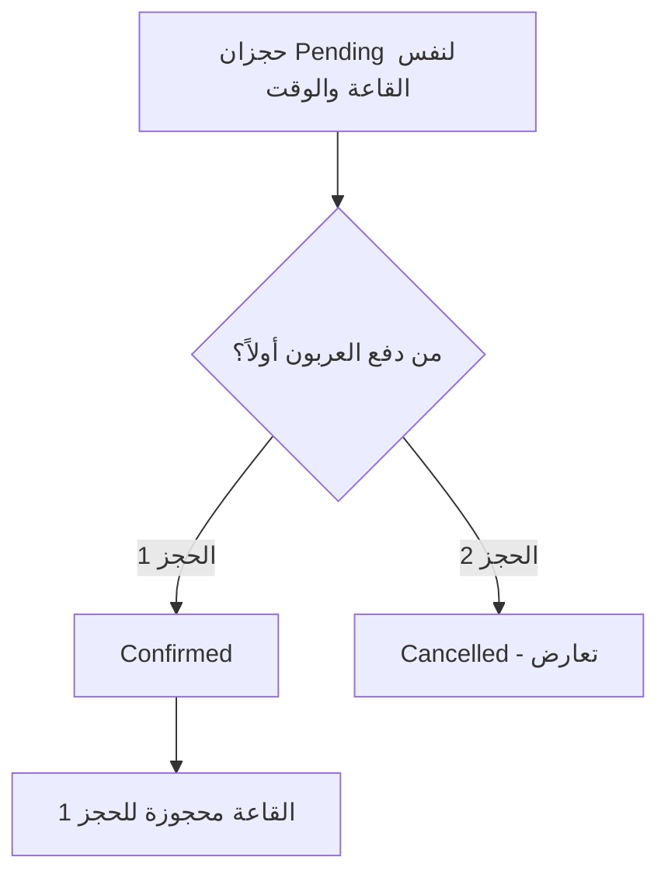
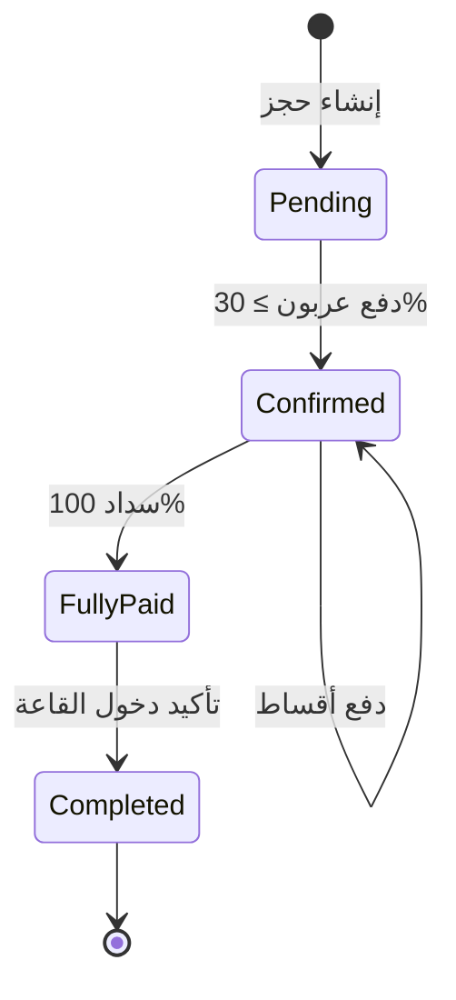
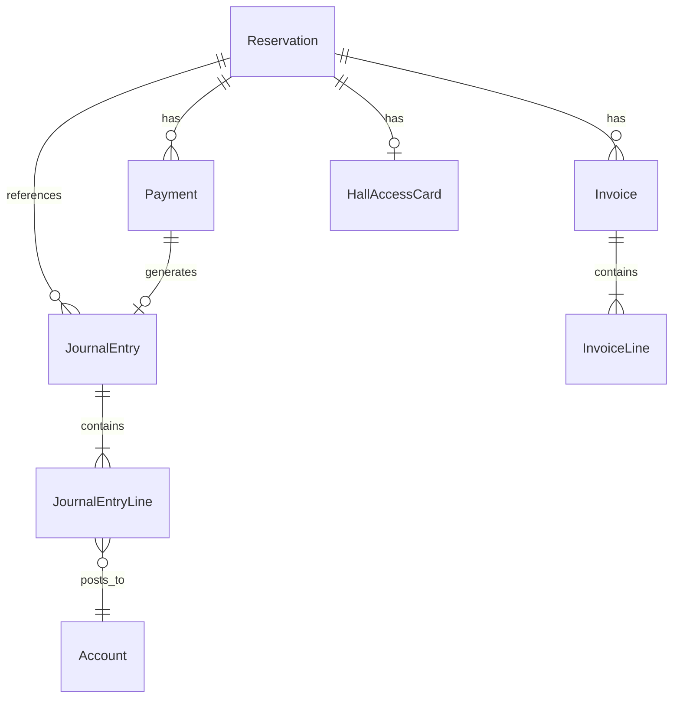
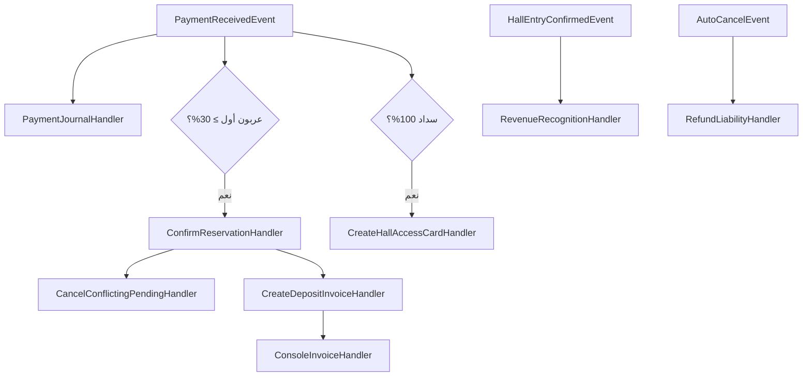

# النظام المالي لإدارة قاعات الأفراح

## وثيقة التحليل والتصميم — الإصدار 2.0

| البند | التفاصيل |
|-------|----------|
| **المشروع** | BanquetHallManagement |
| **الإطار** | ABP Framework 10 / DDD |
| **العملة** | ريال يمني (YER) |
| **نطاق المرحلة الأولى** | حجوزات · فواتير · دفعات · قيود · بطاقة دخول · تقارير |
| **الحالة** | وثيقة معتمدة للتنفيذ — محدّثة |

---

## فهرس المحتويات

1. [الهدف والرؤية](#1-الهدف-والرؤية)
2. [المبادئ المحاسبية](#2-المبادئ-المحاسبية)
3. [مرحلة إنشاء الحجز والتعارض الزمني](#3-مرحلة-إنشاء-الحجز-والتعارض-الزمني)
4. [دفع العربون](#4-دفع-العربون)
5. [سداد الأقساط والمبلغ المتبقي](#5-سداد-الأقساط-والمبلغ-المتبقي)
6. [اكتمال السداد وبطاقة الدخول](#6-اكتمال-السداد-وبطاقة-الدخول)
7. [الإلغاء التلقائي قبل المناسبة](#7-الإلغاء-التلقائي-قبل-المناسبة)
8. [تأكيد دخول القاعة](#8-تأكيد-دخول-القاعة)
9. [دورة حياة الحجز](#9-دورة-حياة-الحجز)
10. [حالات الحجز وقواعد الانتقال](#10-حالات-الحجز-وقواعد-الانتقال)
11. [الكيانات والهيكل](#11-الكيانات-والهيكل)
12. [شجرة الحسابات](#12-شجرة-الحسابات)
13. [القيود المحاسبية](#13-القيود-المحاسبية)
14. [الفواتير والدفعات](#14-الفواتير-والدفعات)
15. [الإلغاء والاسترجاع](#15-الإلغاء-والاسترجاع)
16. [الأحداث والمعالجات](#16-الأحداث-والمعالجات)
17. [واجهات المستخدم](#17-واجهات-المستخدم)
18. [التقارير المالية](#18-التقارير-المالية)
19. [الهيكل التقني والتغييرات على الكود الحالي](#19-الهيكل-التقني-والتغييرات-على-الكود-الحالي)
20. [خطة التنفيذ](#20-خطة-التنفيذ)
21. [ملحق: سيناريو رقمي كامل](#21-ملحق-سيناريو-رقمي-كامل)

---

## 1. الهدف والرؤية

### 1.1 الهدف

بناء نظام مالي وتشغيلي متكامل يدعم:

- حجوزات متعددة معلقة لنفس القاعة والوقت حتى دفع العربون.
- تأكيد الحجز بأول عربون مدفوع وإلغاء المتعارضة تلقائياً.
- سياسة عربون **غير قابل للاسترداد** (إيراد فوري).
- أقساط قابلة للاسترداد (إيراد مؤجّل).
- بطاقة دخول عند السداد الكامل.
- إلغاء تلقائي قبل المناسبة عند عدم اكتمال السداد.
- ترحيل الإيراد المؤجّل عند تأكيد دخول القاعة فعلياً.

### 1.2 سياسات القاعة المعتمدة

| السياسة | القرار |
|---------|--------|
| العربون | **غير قابل للاسترداد** في جميع الحالات |
| الحد الأدنى للعربون | **30%** من إجمالي الحجز |
| الحد الأدنى لكل قسط | **20%** من إجمالي الحجز |
| السداد الكامل | مطلوب قبل المناسبة (مراقبة قبل ساعتين) |
| الحجوزات المعلقة | تتعارض زمنياً **مسموحة** حتى دفع العربون |

### 1.3 التكامل مع المشروع الحالي

| موجود حالياً | التغيير المطلوب |
|--------------|-----------------|
| `Pending` · `Confirmed` · `Cancelled` · `Completed` | إضافة حالة **`FullyPaid`** |
| منع التعارض الزمني لجميع الحجوزات | السماح بالتعارض لـ `Pending` فقط |
| `Confirm()` يدوي | يصبح تلقائياً عند دفع العربون |
| `Complete()` | يصبح عبر زر **«تأكيد دخول القاعة»** |
| لا يوجد نظام مالي | إضافة Finance Module |

---

## 2. المبادئ المحاسبية

### 2.1 القواعد الذهبية (الإصدار 2.0)

```
┌──────────────────────────────────────────────────────────────────────┐
│  1. لا قيد محاسبي عند إنشاء الحجز (Pending فقط)                      │
│  2. العربون = إيراد فعلي فوري (غير قابل للاسترداد)                   │
│  3. الأقساط = إيراد مؤجّل (قابل للاسترداد عند الإلغاء)               │
│  4. الإيراد المؤجّل يُرحَّل إلى إيراد نهائي عند تأكيد دخول القاعة    │
│  5. كل قبض = Payment + فاتورة + قيد محاسبي                           │
│  6. القيد متوازن: مجموع المدين = مجموع الدائن                        │
└──────────────────────────────────────────────────────────────────────┘
```

### 2.2 الفرق بين أنواع الدفعات

| نوع الدفع | المحاسبة | قابل للاسترداد | متى يُعترف كإيراد نهائي |
|-----------|----------|----------------|-------------------------|
| **عربون (Deposit)** | إيراد فوري | ❌ لا | **فور استلامه** |
| **قسط (Installment)** | إيراد مؤجّل | ✅ نعم | عند **تأكيد دخول القاعة** |
| **دفعة نهائية (Final)** | إيراد مؤجّل | ✅ نعم (قبل الدخول) | عند **تأكيد دخول القاعة** |

### 2.3 تصحيح التقارير الحالية

> التقارير الحالية تعتمد على `TotalPrice`. بعد التطبيق:
>
> - **إيراد العربون الفوري** ← قيود العربون عند الدفع.
> - **الإيراد المؤجّل** ← رصيد حساب «إيرادات مؤجلة».
> - **الإيراد النهائي الكامل** ← عند `Completed` (ترحيل المؤجّل).

---

## 3. مرحلة إنشاء الحجز والتعارض الزمني

### 3.1 الإجراء

يقوم الموظف بإنشاء حجز وإدخال: العميل · القاعة · التاريخ · الوقت · الخدمات · عدد الضيوف.

### 3.2 الحالة بعد الحفظ

```text
Status = Pending (معلق / بانتظار الدفع)
```

| البند | الحالة |
|-------|--------|
| فاتورة | ❌ لا |
| قيد محاسبي | ❌ لا |
| إيراد | ❌ لا |
| حجز القاعة | ❌ غير محجوزة فعلياً |

### 3.3 آلية الحجوزات المعلقة المتعارضة

**طالما الحجز `Pending`:**

- يُسمح بإنشاء حجوزات أخرى لـ **نفس القاعة** و**نفس الوقت** (أو متداخلة زمنياً).
- تُحفظ جميعها بحالة `Pending`.

**مثال:**

```text
الموظف A: حجز القاعة D · 2:00–4:00 م → Pending
الموظف B: حجز القاعة D · 2:00–4:00 م → Pending  ✓ مسموح
الموظف A: حجز ثالث لنفس الفترة          → Pending  ✓ مسموح
```

### 3.4 التأكيد بأول عربون (Winner Takes All)

**أول عميل يدفع عربوناً مؤهلاً (≥ 30%)** يصبح حجزه:

```text
Status = Confirmed
```

**يقوم النظام تلقائياً بـ:**

1. الإبقاء على الحجز المؤكد.
2. إلغاء **جميع** الحجوزات `Pending` الأخرى التي:
   - تخص **نفس القاعة**.
   - **تتعارض زمنياً** مع الحجز المؤكد.

### 3.5 سبب إلغاء الحجوزات المتعارضة

```text
Status = Cancelled
CancellationReason = تم إلغاء الحجز بسبب تأكيد حجز آخر لنفس القاعة
                     ونفس الفترة الزمنية بعد دفع العربون.
```

- لا يمكن إجراء أي دفعة على حجز `Cancelled`.
- لا أثر مالي على الحجوزات الملغاة (لم يُدفع شيء).



---

## 4. دفع العربون

### 4.1 الشروط

```text
قيمة العربون ≥ 30% من إجمالي قيمة الحجز
```

**مثال:** إجمالي = 100,000 → الحد الأدنى للعربون = 30,000

### 4.2 عند دفع العربون — التسلسل

| # | العملية |
|---|---------|
| 1 | تسجيل `Payment` (نوع: `Deposit`) |
| 2 | تحويل الحالة: `Pending` → `Confirmed` |
| 3 | إلغاء الحجوزات `Pending` المتعارضة |
| 4 | إنشاء **فاتورة العربون** |
| 5 | إنشاء **قيد محاسبي** (عربون = إيراد فوري) |
| 6 | إطلاق حدث `DepositInvoiceCreatedEvent` |
| 7 | المعالج يعرض الفاتورة في **Console** (المرحلة الحالية) |
| 8 | مستقبلاً: إرسال الفاتورة بالبريد الإلكتروني |

### 4.3 المعالجة المحاسبية للعربون

> **العربون إيراد فعلي ومحقق فوراً** — لأن سياسة القاعة: غير قابل للاسترداد.

| الحساب | مدين | دائن |
|--------|------|------|
| الصندوق (1100) | 30,000 | |
| إيرادات العربون غير المستردة (4110) | | 30,000 |

### 4.4 ما لا يحدث عند العربون

- ❌ لا يُسجّل في «إيرادات مؤجلة».
- ❌ لا يُعاد عند الإلغاء (ما عدا حالات خاصة مستقبلية).

---

## 5. سداد الأقساط والمبلغ المتبقي

### 5.1 السماح بالأقساط

بعد `Confirmed`، يمكن للعميل سداد المتبقي على **دفعات متعددة**.

### 5.2 شرط كل قسط

```text
قيمة كل قسط ≥ 20% من إجمالي قيمة الحجز
```

**مثال:** إجمالي = 100,000 → الحد الأدنى لكل قسط = 20,000

### 5.3 عند كل عملية سداد (قسط)

| # | العملية |
|---|---------|
| 1 | تسجيل `Payment` (نوع: `Installment` أو `Final`) |
| 2 | إنشاء **فاتورة للقسط** |
| 3 | تسجيل **قيد محاسبي** للقسط |
| 4 | تحديث `PaidAmount` و `RemainingAmount` |

### 5.4 المعالجة المحاسبية للأقساط

> الأقساط **لا تُسجَّل كإيراد نهائي** عند استلامها.  
> السبب: العميل قد يلغي الحجز ويستردها (بخلاف العربون).

| الحساب | مدين | دائن |
|--------|------|------|
| الصندوق (1100) | 20,000 | |
| إيرادات مؤجلة (2300) | | 20,000 |

**ملاحظة:** «إيرادات مؤجلة» هنا تُعامل كـ **التزام** تجاه العميل حتى تنفيذ الخدمة.

---

## 6. اكتمال السداد وبطاقة الدخول

### 6.1 الشرط

```text
PaidAmount >= TotalPrice  (100%)
```

### 6.2 عند اكتمال السداد

| # | العملية |
|---|---------|
| 1 | تحديث الحالة: `Confirmed` → **`FullyPaid`** |
| 2 | إنشاء **بطاقة دخول القاعة** (`HallAccessCard`) |

### 6.3 محتوى بطاقة الدخول

| الحقل |
|-------|
| بيانات العميل |
| بيانات القاعة |
| تاريخ المناسبة |
| وقت الدخول |
| وقت الخروج |
| رقم الحجز / رقم البطاقة |
| معلومات إضافية حسب الحاجة |

### 6.4 ملاحظة

`FullyPaid` لا يعني اكتمال المناسبة — الخدمة لم تُنفَّذ بعد. الإيراد المؤجّل ما زال محتجزاً حتى تأكيد الدخول.

---

## 7. الإلغاء التلقائي قبل المناسبة

### 7.1 الشرط

```text
الحجز = Confirmed أو FullyPaid (غير مكتمل السداد الكامل)
AND الوقت المتبقي على المناسبة < ساعتين
AND PaidAmount < TotalPrice
```

### 7.2 الإجراءات التلقائية

| # | الإجراء |
|---|---------|
| 1 | إلغاء الحجز → `Cancelled` |
| 2 | منع استخدام القاعة |
| 3 | **الاحتفاظ بالعربون** (إيراد محقق — لا يُسترد) |
| 4 | تسجيل الأقساط المدفوعة كـ **التزام مستحق للعميل** (قابلة للاسترداد) |

### 7.3 المعالجة المحاسبية

**العربون:** لا تغيير (بقي إيراداً).

**الأقساط المدفوعة:**

| الحساب | مدين | دائن |
|--------|------|------|
| إيرادات مؤجلة (2300) | 50,000 | |
| مستحقات العملاء (2200) | | 50,000 |

> العميل يستحق استرداد كل ما دفعه **ما عدا العربون**.

### 7.4 عند صرف الاسترداد

| الحساب | مدين | دائن |
|--------|------|------|
| مستحقات العملاء (2200) | 50,000 | |
| الصندوق (1100) | | 50,000 |

---

## 8. تأكيد دخول القاعة

### 8.1 الإجراء

يوجد زر في النظام: **«تأكيد دخول القاعة»**

- يضغطه الموظف عند دخول العميل وبدء المناسبة **فعلياً**.
- يتطلب الحالة: **`FullyPaid`**.

### 8.2 عند الضغط

| # | العملية |
|---|---------|
| 1 | إغلاق الحجز → `Completed` |
| 2 | ترحيل **إيرادات مؤجلة** إلى **إيرادات نهائية** |
| 3 | تسجيل القيود المحاسبية النهائية |
| 4 | يصبح كامل مبلغ الحجز (بما فيه المؤجّل) إيراداً فعلياً للمنشأة |

### 8.3 قيد الترحيل (مثال)

**إجمالي الحجز 100,000 — عربون 30,000 (إيراد سابق) + أقساط 70,000 (مؤجلة):**

| الحساب | مدين | دائن |
|--------|------|------|
| إيرادات مؤجلة (2300) | 70,000 | |
| إيرادات القاعات (4100) | | 56,000 |
| إيرادات الخدمات (4200) | | 14,000 |

> التوزيع بين القاعة والخدمات من `InvoiceLine`.

---

## 9. دورة حياة الحجز

### 9.1 المسار الرئيسي (سعيد)



```text
Pending
   │
   ├─ دفع العربون (≥ 30%)
   ▼
Confirmed
   │
   ├─ دفع الأقساط (كل قسط ≥ 20%)
   ▼
FullyPaid
   │
   ├─ تأكيد دخول القاعة
   ▼
Completed
```

### 9.2 مسار الإلغاء بالتعارض

```text
Pending
   │
   ├─ تأكيد حجز آخر لنفس القاعة والوقت
   ▼
Cancelled  (بدون أثر مالي)
```

### 9.3 مسار الإلغاء لعدم اكتمال السداد

```text
Confirmed (غير FullyPaid)
   │
   ├─ بقي أقل من ساعتين ولم يُسدَّد الكامل
   ▼
Cancelled
   ├─ العربون: يبقى إيراداً
   └─ الأقساط: مستحقات للعميل
```

---

## 10. حالات الحجز وقواعد الانتقال

### 10.1 تعريف الحالات

| الحالة | الوصف | القاعة |
|--------|-------|--------|
| `Pending` | بانتظار العربون | غير محجوزة (تعارض مسموح) |
| `Confirmed` | عُربن، سداد جزئي أو جاري | **محجوزة** |
| `FullyPaid` | سُدِّد 100%، بانتظار المناسبة | محجوزة |
| `Completed` | تمت المناسبة | متاحة بعد انتهاء الوقت |
| `Cancelled` | ملغى | متاحة |

### 10.2 جدول الانتقالات

| من | إلى | المحفّز | أثر مالي |
|----|-----|---------|----------|
| — | `Pending` | إنشاء | لا شيء |
| `Pending` | `Confirmed` | عربون ≥ 30% | إيراد عربون + إلغاء المتعارضة |
| `Confirmed` | `Confirmed` | قسط ≥ 20% | إيراد مؤجّل |
| `Confirmed` | `FullyPaid` | مجموع الدفعات = 100% | بطاقة دخول |
| `FullyPaid` | `Completed` | تأكيد دخول القاعة | ترحيل مؤجّل → إيراد |
| `Pending` | `Cancelled` | تعارض مع مؤكد | لا شيء |
| `Confirmed` | `Cancelled` | < ساعتين وغير مكتمل | عربون يبقى + مستحقات |

### 10.3 قواعد الدفع

| القاعدة | القيمة |
|---------|--------|
| الحد الأدنى للعربون | 30% من الإجمالي |
| الحد الأدنى لكل قسط | 20% من الإجمالي |
| دفعة على `Cancelled` | **مرفوضة** |
| دفعة على `Pending` أولى ≥ 30% | تؤكد + تلغي المتعارضة |

### 10.4 تعديل الحجز

| الحالة | تعديل البيانات / السعر |
|--------|------------------------|
| `Pending` | مسموح |
| `Confirmed` | محدود (لا تغيير سعر بعد العربون — المرحلة 1) |
| `FullyPaid` / `Completed` / `Cancelled` | ممنوع |

---

## 11. الكيانات والهيكل

### 11.1 مخطط العلاقات



### 11.2 Payment

```csharp
public class Payment : FullAuditedAggregateRoot<Guid>
{
    public Guid ReservationId { get; private set; }
    public decimal Amount { get; private set; }
    public DateTime PaymentDate { get; private set; }
    public PaymentType PaymentType { get; private set; }
    // Deposit | Installment | Final
    public string ReceiptNumber { get; private set; }
    public Guid? ReceivedByEmployeeId { get; private set; }
    public string Notes { get; private set; }
    public Guid? JournalEntryId { get; private set; }
    public Guid? InvoiceId { get; private set; }
}
```

### 11.3 Invoice

```csharp
public class Invoice : FullAuditedAggregateRoot<Guid>
{
    public string InvoiceNumber { get; private set; }
    public Guid ReservationId { get; private set; }
    public InvoiceType InvoiceType { get; private set; }
    // Deposit | Installment | Final
    public decimal Amount { get; private set; }
    public DateTime IssuedAt { get; private set; }
    public Guid? IssuedByEmployeeId { get; private set; }
}
```

> **ملاحظة:** فاتورة منفصلة لكل دفعة (عربون · كل قسط).

### 11.4 HallAccessCard — بطاقة الدخول

```csharp
public class HallAccessCard : FullAuditedEntity<Guid>
{
    public Guid ReservationId { get; private set; }
    public string CardNumber { get; private set; }
    public DateTime IssuedAt { get; private set; }
    public DateTime EventDate { get; private set; }
    public TimeSpan EntryTime { get; private set; }
    public TimeSpan ExitTime { get; private set; }
    public bool IsUsed { get; private set; }
}
```

### 11.5 Reservation — حقول إضافية مقترحة

```csharp
public decimal PaidAmount { get; private set; }
public string CancellationReason { get; private set; }
public CancellationType? CancellationType { get; private set; }
// ConflictOverride | NonPaymentAutoCancel | Manual
```

### 11.6 ReservationStatus — المحدّث

```csharp
public enum ReservationStatus
{
    Pending = 1,
    Confirmed = 2,
    Cancelled = 3,
    Completed = 4,
    FullyPaid = 5      // جديد
}
```

### 11.7 JournalEntry · JournalEntryLine · Account

*(كما في الإصدار 1.0 مع إضافة `SourceType`: DepositRevenue · DeferredRevenue · RevenueRecognition · RefundLiability · RefundPayment)*

---

## 12. شجرة الحسابات

```text
1000  الأصول
 └─ 1100  الصندوق

2000  الالتزامات
 ├─ 2200  مستحقات العملاء (استرداد أقساط)
 └─ 2300  إيرادات مؤجلة

4000  الإيرادات
 ├─ 4100  إيرادات القاعات
 ├─ 4200  إيرادات الخدمات
 └─ 4110  إيرادات العربون غير المستردة
```

### 12.1 دور كل حساب

| الحساب | الدور |
|--------|-------|
| 1100 الصندوق | كل القبض والصرف النقدي |
| 4110 إيرادات العربون | إيراد فوري عند العربون |
| 2300 إيرادات مؤجلة | أقساط حتى تأكيد الدخول |
| 2200 مستحقات العملاء | أقساط مستحقة الاسترداد عند الإلغاء |
| 4100 / 4200 | إيراد نهائي عند `Completed` |

---

## 13. القيود المحاسبية

### 13.1 ملخص القيود

| الحدث | مدين | دائن |
|-------|------|------|
| عربون 30,000 | الصندوق | إيرادات العربون |
| قسط 20,000 | الصندوق | إيرادات مؤجلة |
| تأكيد دخول (ترحيل 70,000) | إيرادات مؤجلة | إيرادات قاعة + خدمات |
| إلغاء auto (أقساط 50,000) | إيرادات مؤجلة | مستحقات العملاء |
| صرف استرداد | مستحقات العملاء | الصندوق |

### 13.2 قيد العربون — تفصيل

```text
إجمالي الحجز = 100,000
العربون      =  30,000

مدين: الصندوق                    30,000
دائن: إيرادات العربون غير المستردة        30,000
```

### 13.3 قيد القسط — تفصيل

```text
قسط = 20,000

مدين: الصندوق                    20,000
دائن: إيرادات مؤجلة                       20,000
```

### 13.4 قيد تأكيد الدخول — تفصيل

```text
مؤجّل = 70,000 (قاعة 56,000 + خدمات 14,000)

مدين: إيرادات مؤجلة              70,000
دائن: إيرادات القاعات                     56,000
دائن: إيرادات الخدمات                     14,000
```

---

## 14. الفواتير والدفعات

### 14.1 سياسة الفواتير

| الدفعة | الفاتورة |
|--------|----------|
| عربون | فاتورة عربون منفصلة |
| كل قسط | فاتورة قسط منفصلة |
| الدفعة الأخيرة | فاتورة نهائية |

### 14.2 إرسال الفاتورة

| المرحلة | الآلية |
|---------|--------|
| الحالية | `DepositInvoiceCreatedEvent` → Handler → **Console** |
| مستقبلاً | نفس الحدث → Handler → **Email** |

### 14.3 محتوى الفاتورة

رقم الفاتورة · العميل · الموظف · القاعة · التاريخ · الوقت · الضيوف · الخدمات · المبلغ · نوع الدفعة · تاريخ الإصدار.

### 14.4 التصدير

Print · PDF (المرحلة 1) · Email (المرحلة 2).

---

## 15. الإلغاء والاسترجاع

### 15.1 ملخص حسب السيناريو

| السيناريو | العربون | الأقساط |
|-----------|---------|---------|
| إلغاء `Pending` (تعارض) | — | — |
| إلغاء auto (عدم سداد) | **يبقى إيراداً** | **مستحقات → استرداد** |
| إلغاء يدوي بعد `Confirmed` | **يبقى إيراداً** | **مستحقات → استرداد** |
| `Completed` | إيراد محقق | مُرحَّلة لإيراد نهائي |

### 15.2 سبب الإلغاء (CancellationReason)

يُسجَّل دائماً عند `Cancelled`:

| النوع | النص النموذجي |
|-------|---------------|
| `ConflictOverride` | تأكيد حجز آخر لنفس القاعة والفترة |
| `NonPaymentAutoCancel` | عدم اكتمال السداد قبل الموعد بساعتين |
| `Manual` | إلغاء يدوي من الموظف |

---

## 16. الأحداث والمعالجات

### 16.1 مخطط الأحداث



### 16.2 جدول المعالجات

| الحدث | المعالج | المسؤولية |
|-------|---------|-----------|
| `PaymentReceivedEvent` | `PaymentJournalHandler` | قيد (عربون أو مؤجّل) |
| `PaymentReceivedEvent` | `ConfirmReservationHandler` | Pending → Confirmed |
| `PaymentReceivedEvent` | `CancelConflictingPendingHandler` | إلغاء المتعارضة |
| `DepositInvoiceCreatedEvent` | `ConsoleInvoiceHandler` | عرض الفاتورة |
| `PaymentReceivedEvent` | `FullyPaidHandler` | Confirmed → FullyPaid + بطاقة |
| `HallEntryConfirmedEvent` | `RevenueRecognitionHandler` | ترحيل مؤجّل → إيراد |
| `ReservationAutoCancelledEvent` | `RefundLiabilityHandler` | أقساط → مستحقات |

### 16.3 ضمانات تقنية

- معاملة واحدة (UoW) لكل دفعة: Payment + Journal + Invoice + تغيير حالة.
- Idempotency على `PaymentId`.
- Job مجدول: فحص الحجوزات قبل ساعتين من الموعد.

---

## 17. واجهات المستخدم

### 17.1 شاشات جديدة / معدّلة

| الشاشة | الوظيفة |
|--------|---------|
| تسجيل دفعة | عربون / قسط مع التحقق من النسب |
| بطاقة الدخول | عرض · طباعة |
| تأكيد دخول القاعة | زر على حجز `FullyPaid` |
| القيود اليومية | عرض + فلاتر |
| الفواتير | عرض · طباعة · PDF |

### 17.2 تعديل شاشة الحجوزات

- إظهار `PaidAmount` / `RemainingAmount` / نسبة السداد.
- إخفاء زر Confirm اليدوي — الاستبدال بـ «تسجيل دفعة».
- إظهار سبب الإلغاء على الحجوزات الملغاة.

### 17.3 الصلاحيات المقترحة

`Finance.Payments.Create` · `Reservations.RecordPayment` · `Reservations.ConfirmHallEntry` · `Finance.Invoices.View` · `Finance.JournalEntries.View`

---

## 18. التقارير المالية

| التقرير | المصدر |
|---------|--------|
| إيرادات العربون (فورية) | حساب 4110 |
| إيرادات مؤجلة (رصيد) | حساب 2300 |
| مستحقات العملاء | حساب 2200 |
| إيراد نهائي (قاعة + خدمات) | حساب 4100 + 4200 |
| التحصيلات اليومية | `Payment` |
| حجوزات معلقة متعارضة | `Pending` + نفس القاعة/الوقت |

---

## 19. الهيكل التقني والتغييرات على الكود الحالي

### 19.1 تغييرات Domain — Reservations

| الملف / المنطق | التغيير |
|----------------|---------|
| `ReservationSchedulingManager` | السماح بتعارض `Pending` فقط |
| `Reservation.Confirm()` | يُستدعى من Payment flow وليس يدوياً |
| `ReservationStatus` | إضافة `FullyPaid = 5` |
| `Reservation.Complete()` | يتطلب `FullyPaid` + `HallEntryConfirmed` |
| `BlocksScheduling()` | `Confirmed` و `FullyPaid` فقط يحجزان القاعة |

### 19.2 وحدة Finance (جديدة)

```text
Finance/
├── Payments/
├── Invoices/
├── Accounting/
├── HallAccessCards/
└── Services/
    ├── PaymentManager
    ├── DepositConfirmationService
    ├── ConflictingReservationCancellationService
    ├── JournalPostingService
    ├── RevenueRecognitionService
    └── AutoCancelMonitorService (Background Job)
```

### 19.3 الفرق عن الإصدار 1.0

| الموضوع | الإصدار 1.0 | الإصدار 2.0 |
|---------|-------------|-------------|
| تعارض Pending | غير مسموح | **مسموح** |
| العربون محاسبياً | التزام (خصوم) | **إيراد فوري** |
| الأقساط | نفس معاملة العربون | **إيراد مؤجّل** |
| حالة وسيطة | لا | **FullyPaid** |
| الإتمام | تلقائي بعد المناسبة | **زر تأكيد دخول** |
| إلغاء عدم السداد | غير مفصّل | **auto + مستحقات** |
| بطاقة دخول | لا | **نعم** |
| فاتورة | واحدة للحجز | **فاتورة لكل دفعة** |

---

## 20. خطة التنفيذ

```text
1.  تعديل منطق التعارض الزمني (Pending مسموح)
2.  إضافة FullyPaid + PaidAmount + CancellationReason
3.  شجرة الحسابات (Seed)
4.  Payment Module + قواعد 30% / 20%
5.  Journal Module (عربون فوري + مؤجّل)
6.  Confirm + إلغاء المتعارضة عند العربون
7.  Invoice per payment + Console handler
8.  FullyPaid + HallAccessCard
9.  زر تأكيد دخول القاعة + RevenueRecognition
10. Background Job: إلغاء auto قبل ساعتين
11. Refund liability + صرف استرداد
12. تعديل التقارير + واجهات Angular
13. PDF + Email (لاحقاً)
```

---

## 21. ملحق: سيناريو رقمي كامل

**الحجز:** قاعة 80,000 + خدمات 20,000 = **100,000 YER**

### المرحلة 1 — حجزان Pending

```text
حجز أحمد: Pending · القاعة D · 2–4 م
حجز سارة: Pending · القاعة D · 2–4 م   ← مسموح
```

### المرحلة 2 — أحمد يدفع عربون 30,000

| البند | القيمة |
|-------|--------|
| حجز أحمد | Confirmed |
| حجز سارة | Cancelled (تعارض) |
| قيد | صندوق ← إيراد عربون 30,000 |
| فاتورة عربون | تُعرض في Console |

### المرحلة 3 — قسط 20,000

| البند | القيمة |
|-------|--------|
| المدفوع | 50,000 |
| المتبقي | 50,000 |
| قيد | صندوق ← مؤجّل 20,000 |

### المرحلة 4 — قسط 50,000 (نهائي)

| البند | القيمة |
|-------|--------|
| الحالة | FullyPaid |
| بطاقة دخول | تُنشأ |
| قيد | صندوق ← مؤجّل 50,000 |

### المرحلة 5 — تأكيد دخول القاعة

| البند | القيمة |
|-------|--------|
| الحالة | Completed |
| قيد ترحيل | مؤجّل 70,000 → قاعة 56,000 + خدمات 14,000 |
| إجمالي الإيراد | 100,000 (30 فوري + 70 عند الدخول) |

### سيناريو بديل — إلغاء auto

```text
مدفوع: عربون 30,000 + قسط 20,000 = 50,000
المتبقي: 50,000
قبل الموعد بساعتين: لم يُسدَّد

→ Cancelled
→ العربون 30,000: يبقى إيراداً
→ القسط 20,000: مستحقات للعميل → يُسترد نقداً
```

---

## سجل التعديلات

| الإصدار | التاريخ | التغيير |
|---------|---------|---------|
| 1.0 | 2026-06-10 | الوثيقة الأولى |
| 2.0 | 2026-06-10 | تحديث شامل: تعارض Pending · عربون إيراد فوري · أقساط مؤجلة · FullyPaid · بطاقة دخول · إلغاء auto · تأكيد دخول |

---

*نهاية الوثيقة*
